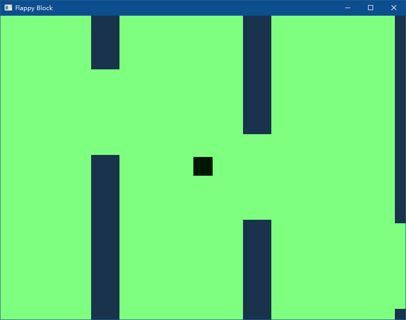

# Flappy Block

## 关于

这是一个仿照 *Flappy Bird* 的游戏。  



## 硬件需求

- 支持OpenGL 3.3 core的显卡  

*宽高比越大，同屏下的障碍物会越多，对显卡和CPU的需求会略微上升。*

## 构建

本项目编写时使用`vcpkg`管理包，在使用其他包管理软件时，构建过程可能会略有不同甚至构建失败。  
本项目依赖`glfw3`、`GLEW`和`glm`，需要`C++ 17`标准，你可以安装`cmake`来自动生成项目文件。  

使用`cmake`时注意指定`CMAKE_TOOLCHAIN_PATH`  
```
cmake . -DCMAKE_TOOLCHAIN_PATH=<[vcpkg安装路径]/scripts/buildsystems/vcpkg.cmake>
```

## 其他

- 本游戏有计分系统，体现在玩家的颜色（蓝绿通道）上。分数和跨越的障碍数无关，是按行进距离算的，最大可记录4096分。
- 本游戏也有碰撞系统，和柱子碰撞时玩家会变成红色。
